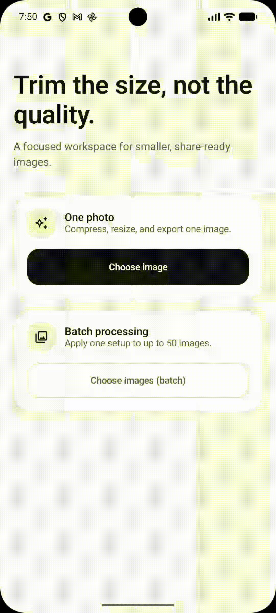

# PicTrim

**PicTrim** is an Android app for preparing smaller, share-ready images—entirely on your device. Compress, resize, crop, choose an output format, then save or share the result without uploading your photos to a server.

<p align="center">
  
</p>

> Privacy made simple: your images are processed locally and never leave your phone.

## Features

- Compress images with adjustable quality and an approximate target file size.
- Resize by dimensions or percentage while preserving the aspect ratio.
- Center-crop with **Original**, **1:1**, **4:5**, **9:16**, and **16:9** presets.
- Export as **JPG**, **PNG**, or **WebP**, or keep the original format.
- Remove EXIF metadata—including GPS, camera, and date information—when needed.
- Process up to **50 images** in one batch, with progress shown in a notification.
- Compare the original image's size and dimensions with the processed result before saving.
- Save to `Pictures/PicTrim`, open the result in the gallery, or share it directly.
- Available in English and Indonesian.

## Built with

- Kotlin and Jetpack Compose (Material 3)
- Hilt for dependency injection
- WorkManager for background batch processing
- Android Photo Picker, MediaStore, and FileProvider
- Coil for image previews
- Preferences DataStore for onboarding state

## How it works

1. Choose one image or several images from your gallery.
2. Set the processing mode: compress, resize, or both.
3. Choose quality, dimensions, output format, crop, and metadata settings.
4. Process the image and review the comparison.
5. Save it to your gallery or share it directly.

For batch processing, PicTrim applies the same settings to every selected image and processes them sequentially to keep memory use manageable.

## Privacy and storage

- PicTrim processes images on-device; no upload service or account is required.
- Batch outputs remain private temporary files until you choose to save them.
- Saved images are added to `Pictures/PicTrim` through MediaStore.
- When **Remove metadata** is enabled, EXIF data such as GPS, camera, and date information is removed. This setting alone does not alter image pixels.

## Project structure

```text
app/src/main/java/com/prammmoe/pictrim/
├── data/       # Android implementation: bitmap processing, MediaStore, and batches
├── di/         # Hilt dependency-injection module
├── domain/     # Models, processing rules, repository, and use cases
└── ui/         # Compose screens, ViewModels, components, and theme
```

## Format support

PicTrim accepts images Android can decode and explicitly supports JPG, PNG, and WebP output. EXIF orientation is applied before processing so the exported image maintains the correct orientation.

## License

Copyright © 2026 Pramuditha Muhammad Ikhwan. This repository is available for portfolio, educational, and reference purposes. Reuse, redistribution, public forks, and commercial use require written permission from the copyright holder. See [LICENSE.md](LICENSE.md) for the full terms.
